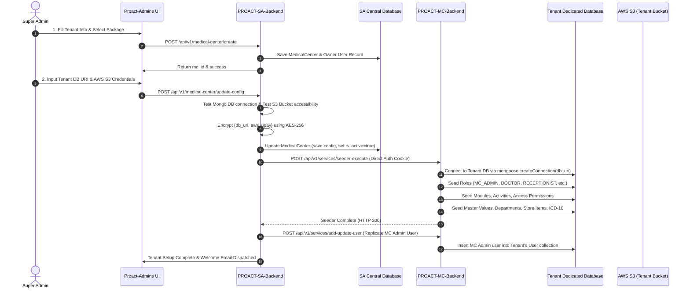
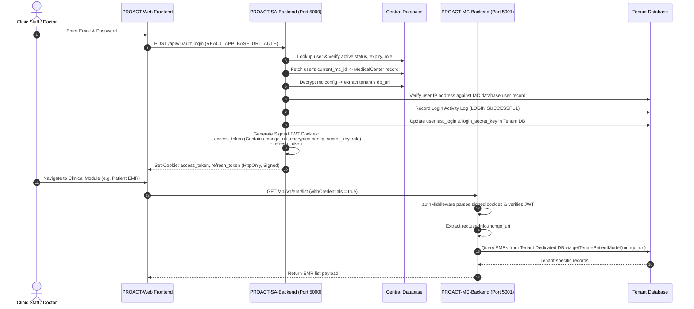
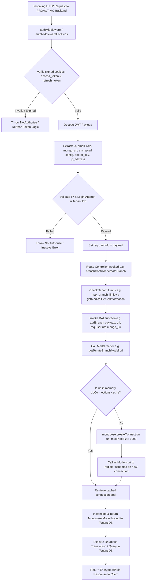

# PROACT System: Comprehensive Multi-Tenant Architecture, Flow & Implementation Analysis

---

## 1. Executive Summary & Ecosystem Overview

**PROACT** is an enterprise-grade, cloud-native **Multi-Tenant Healthcare & Medical Center Management Ecosystem** (EHR/EMR, Practice Management, Clinical Diagnosis, In-Patient Department, Laboratory, Radiology, Pharmacy, Billing, Accounts, and HR). 

The system employs an **Isolated Database-per-Tenant** multi-tenancy pattern coordinated through a **Centralized Control Plane (Super Admin)** and executed dynamically across **Dedicated Tenant Data Planes (Medical Centers)**.

```
+----------------------------------------------------------------------------------------------------+
|                                      PROACT ECOSYSTEM ARCHITECTURE                                 |
+----------------------------------------------------------------------------------------------------+
|                                                                                                    |
|    +-----------------------------+                           +--------------------------------+    |
|    |        Proact-Admins        |                           |           PROACT-Web           |    |
|    |    (Super Admin Frontend)   |                           |    (Medical Center Frontend)   |    |
|    |      React 18 + Redux       |                           |   React 18 + Redux + Form.io   |    |
|    +--------------+--------------+                           +---------------+----------------+    |
|                   |                                                          |                     |
|                   | HTTPS / REST                               HTTPS / REST  | (Dual API Base)     |
|                   v                                                          v                     |
|    +-----------------------------+                           +--------------------------------+    |
|    |      PROACT-SA-Backend      |   Broker / Seeder RPC     |       PROACT-MC-Backend        |    |
|    |    (Central Control Plane)  | ------------------------> |      (Tenant Data Plane)       |    |
|    |       Node.js / Express     |                           |       Node.js / Express        |    |
|    +--------------+--------------+                           +---------------+----------------+    |
|                   |                                                          |                     |
|                   v                                                          v                     |
|    +-----------------------------+                           +--------------------------------+    |
|    |    Central MongoDB Cluster  |                           |     Dynamic Tenant DB Pool     |    |
|    |  - MedicalCenter Directory  |                           |  - Tenant A Database (Atlas/DB)|    |
|    |  - Packages & Subscriptions |                           |  - Tenant B Database (Atlas/DB)|    |
|    |  - Global Users & Roles     |                           |  - Tenant N Database (Atlas/DB)|    |
|    |  - Master Catalog Data      |                           |  - Isolated S3 Buckets / Upay  |    |
|    +-----------------------------+                           +--------------------------------+    |
|                                                                                                    |
+----------------------------------------------------------------------------------------------------+
```

### Repository & Component Inventory

| Component | Role | Tech Stack | Port / Base Route | Primary Responsibilities |
| :--- | :--- | :--- | :--- | :--- |
| **`PROACT-SA-Backend`** | Central Control Plane | Node.js, Express, TypeScript, Mongoose, JWT, CryptoJS, S3 | `5000` (`/api/v1/`) | Tenant onboarding, Package management, Global Auth, Tenant DB config encryption, License verification, Event publishing |
| **`PROACT-MC-Backend`** | Tenant Data Plane | Node.js, Express, TypeScript, Dynamic Mongoose Pool, Socket.io | `5001` (`/api/v1/`) | Clinical operations, Patient EMR, Doctor Diagnosis, IPD, Billing, Pharmacy, Inventory, HR, Dynamic DB connection pooling |
| **`PROACT-Web`** | Clinic Web Application | React 18, TypeScript, Redux Toolkit, Redux Persist, SCSS | `3000` | End-user clinic interface for Doctors, Receptionists, Nurses, Accountants, Store Keepers, and MC Admins |
| **`Proact-Admins`** | Super Admin Web App | React 18, TypeScript, Redux Toolkit, SCSS | `3001` | Platform administration, Tenant onboarding wizard, DB URI / S3 bucket provisioning, Package tier configuration |

---

## 2. Multi-Tenant Architecture Strategy

### 2.1 The "Database-per-Tenant" Model
PROACT uses **Full Physical Database Separation** for each tenant (Medical Center), rather than a Shared-Database-Shared-Schema approach with `tenant_id` column discriminators.

```
                           +------------------------+
                           |  Central DB (SA Core)  |
                           |   - medicalcenters     |
                           |   - packages           |
                           |   - modules & features |
                           +-----------+------------+
                                       |
                   +-------------------+-------------------+
                   |                                       |
                   v                                       v
     +---------------------------+           +---------------------------+
     |   Medical Center Alpha    |           |    Medical Center Beta    |
     |   (Dedicated DB Cluster)  |           |   (Dedicated DB Cluster)  |
     |  - users, patients, emrs  |           |  - users, patients, emrs  |
     |  - appointments, billing  |           |  - appointments, billing  |
     |  - pharmacy, inventory    |           |  - pharmacy, inventory    |
     +---------------------------+           +---------------------------+
```

### 2.2 Key Architectural Pillars
1. **Zero Cross-Tenant Data Contamination**:
   A query executing on Medical Center Alpha's database cannot accidentally leak or join with Medical Center Beta's records because the connection string points to an entirely isolated MongoDB instance or database namespace.
2. **Encrypted Tenant Infrastructure Configuration**:
   The tenant's dedicated database URI (`db_uri`), AWS S3 bucket credentials (`aws`), and payment gateway keys (`upay`) are encrypted using AES-256 (`CryptoJS`) and stored in the central `MedicalCenter` model.
3. **Dynamic Connection Pooling**:
   `PROACT-MC-Backend` maintains an in-memory connection cache map (`dbConnections: Record<string, Connection>`). When a request arrives with a tenant's database URI inside the signed JWT payload, the backend resolves or reuses the active connection pool (`maxPoolSize: 1000`) without server restarts.
4. **Isolated Storage & Cloud Assets**:
   Each tenant can supply its own dedicated AWS S3 bucket for patient medical records, lab reports, doctor prescriptions, and scanned documents, configured during onboarding.
5. **Subscription-Based Feature Matrix**:
   Super Admins create `Packages` containing selected `Modules` and `Features` with limits (`max_users_limit`, `max_branch_limit`, `max_department_limit`, `max_patient_limit`, `whatsapp_limit`). These are enforced dynamically at the API gateway layer.

---

## 3. End-to-End Architectural Flows

### Flow 1: Tenant Onboarding & Automated Provisioning Lifecycle



---

### Flow 2: Multi-Tenant Authentication & Session Resolution



---

### Flow 3: Request Interception, Context Resolution & Dynamic Model Initialization



---

## 4. Deep File-by-File Technical Analysis & Indexing

### 4.1 `PROACT-SA-Backend` (Central Control Plane)

#### 1. [`server.ts`](file:///c:/Users/Reyna/Desktop/PROACT-MAIN/PROACT-SA-Backend/src/server.ts)
- **Role**: Entry point for Super Admin backend services.
- **Port**: `5000` (or `process.env.PORT`).
- **Core Operations**:
  - Connects to Central Database via `connectMongo(process.env.MONGO_URI)` ([L80-L83](file:///c:/Users/Reyna/Desktop/PROACT-MAIN/PROACT-SA-Backend/src/server.ts#L80-L83)).
  - Initializes CORS whitelist for web admin and clinic frontend origins ([L25-L62](file:///c:/Users/Reyna/Desktop/PROACT-MAIN/PROACT-SA-Backend/src/server.ts#L25-L62)).
  - Launches cron jobs: `executeMCExpireCheckCronJob` and `executeMCUserExpireCheckCronJob` to disable expired tenants and expired staff accounts ([L97-L101](file:///c:/Users/Reyna/Desktop/PROACT-MAIN/PROACT-SA-Backend/src/server.ts#L97-L101)).

#### 2. [`models/MedicalCenter.ts`](file:///c:/Users/Reyna/Desktop/PROACT-MAIN/PROACT-SA-Backend/src/models/MedicalCenter.ts)
- **Role**: Primary Tenant Metadata Registry.
- **Key Schema Attributes**:
  - `mc_id` & `mc_name`: Unique tenant identifiers.
  - `owner_user_id`: Reference to the primary tenant owner user.
  - `package_id`: Reference to the assigned `Package` defining module access.
  - `db_uri`: Dedicated MongoDB connection string for the tenant.
  - `config`: AES-256 encrypted payload storing `{ db_uri, aws, upay }`.
  - `expiry_date` & `is_active`: Tenant subscription lifecycle status.
  - `max_users_limit`, `max_branch_limit`, `max_department_limit`, `max_patient_limit`, `max_attachment_limit`: Quota enforcement metrics.
  - Pre-save hook: Automatically propagates `is_active` status to the owner user ([L131-L137](file:///c:/Users/Reyna/Desktop/PROACT-MAIN/PROACT-SA-Backend/src/models/MedicalCenter.ts#L131-L137)).

#### 3. [`controllers/super-admin/medicalCenter.ts`](file:///c:/Users/Reyna/Desktop/PROACT-MAIN/PROACT-SA-Backend/src/controllers/super-admin/medicalCenter.ts)
- **Role**: Tenant Provisioning, Utility Configuration & Package Synchronization.
- **Key Functions**:
  - `addMedicalCenter` ([L98-L140](file:///c:/Users/Reyna/Desktop/PROACT-MAIN/PROACT-SA-Backend/src/controllers/super-admin/medicalCenter.ts#L98-L140)): Creates tenant metadata, assigns package, creates owner user with `MC_ADMIN` role, and sends welcome password reset email.
  - `updateConfigMedicalCenter` ([L315-L395](file:///c:/Users/Reyna/Desktop/PROACT-MAIN/PROACT-SA-Backend/src/controllers/super-admin/medicalCenter.ts#L315-L395)): Validates tenant DB connection via `testConnection`, validates S3 bucket via `headBucket`, encrypts credentials, triggers tenant database seeding via `fetch(CONSTANTS.MC_SEEDER_URL)`, and replicates the MC admin user into the tenant DB.
  - `editMedicalCenter` ([L142-L202](file:///c:/Users/Reyna/Desktop/PROACT-MAIN/PROACT-SA-Backend/src/controllers/super-admin/medicalCenter.ts#L142-L202)): Handles tenant package changes and computes module diffs to update permissions dynamically via `updatePermissionInMcFromSa`.

#### 4. [`controllers/authController.ts`](file:///c:/Users/Reyna/Desktop/PROACT-MAIN/PROACT-SA-Backend/src/controllers/authController.ts)
- **Role**: Global Authentication Gateway for all users.
- **Key Functions**:
  - `login` ([L97-L254](file:///c:/Users/Reyna/Desktop/PROACT-MAIN/PROACT-SA-Backend/src/controllers/authController.ts#L97-L254)): Validates user credentials, verifies tenant association and subscription expiry, verifies IP whitelist in tenant database via `getUserDetailsFromMC`, logs login attempts in tenant DB via `addUserActivityLog` and `addUserLastLoginToMc`.
  - `setToken` ([L322-L445](file:///c:/Users/Reyna/Desktop/PROACT-MAIN/PROACT-SA-Backend/src/controllers/authController.ts#L322-L445)): Injects `mongo_uri`, `encryptConfig`, and session credentials into signed JWT cookies (`access_token` and `refresh_token`).

#### 5. [`utils/publisher/publishers.ts`](file:///c:/Users/Reyna/Desktop/PROACT-MAIN/PROACT-SA-Backend/src/utils/publisher/publishers.ts)
- **Role**: Control-Plane to Data-Plane Inter-Service Broker.
- **Functions**:
  - `addUpdateUserToMcFromSa` ([L5-L25](file:///c:/Users/Reyna/Desktop/PROACT-MAIN/PROACT-SA-Backend/src/utils/publisher/publishers.ts#L5-L25)): Synchronizes user changes from SA to the tenant's dedicated DB via `MC_PUSH_USER_URL`.
  - `updatePermissionInMcFromSa` ([L27-L49](file:///c:/Users/Reyna/Desktop/PROACT-MAIN/PROACT-SA-Backend/src/utils/publisher/publishers.ts#L27-L49)): Updates role permissions in the tenant's database when package tiers change.

---

### 4.2 `PROACT-MC-Backend` (Tenant Data Plane)

#### 1. [`server.ts`](file:///c:/Users/Reyna/Desktop/PROACT-MAIN/PROACT-MC-Backend/src/server.ts)
- **Role**: Main Tenant API Server & Realtime Engine.
- **Port**: `5001`.
- **Core Operations**:
  - Notice line 172: Static `connectMongo(...)` is commented out because database connectivity is dynamic per request!
  - Initializes Socket.io with signed cookie JWT authentication ([L178-L192](file:///c:/Users/Reyna/Desktop/PROACT-MAIN/PROACT-MC-Backend/src/server.ts#L178-L192)).
  - Initializes background cron jobs for WhatsApp appointment notifications, appointment status progression, and employee document expiry ([L200-L214](file:///c:/Users/Reyna/Desktop/PROACT-MAIN/PROACT-MC-Backend/src/server.ts#L200-L214)).

#### 2. [`config/mongo.ts`](file:///c:/Users/Reyna/Desktop/PROACT-MAIN/PROACT-MC-Backend/src/config/mongo.ts)
- **Role**: Dynamic Multi-Tenant Connection Manager.
- **Implementation**:
  ```typescript
  const dbConnections: any = {}

  export const connect = async (url: string) => {
      return new Promise(async (resolve, reject) => {
          try {
              if (!url) {
                  const db: any = mongoose.connection;
                  if (db) resolve(db);
              } else {
                  let connection: any
                  if (dbConnections[url]) {
                      connection = dbConnections[url]
                  } else {
                      dbConnections[url] = await mongoose.createConnection(url, { maxPoolSize: 1000 }).asPromise()
                      await initModels(url)
                      connection = dbConnections[url]
                  }
                  resolve(connection)
              }
          } catch (error: any) {
              reject(error.message)
          }
      })
  }
  ```
- **Analysis**:
  - Maintains `dbConnections` hash map keyed by tenant `url`.
  - Instantiates a high-throughput connection pool (`maxPoolSize: 1000`) per tenant database.
  - Automatically invokes `initModels(url)` to compile Mongoose schemas on the newly connected database.

#### 3. [`middlewares/authMiddleware.ts`](file:///c:/Users/Reyna/Desktop/PROACT-MAIN/PROACT-MC-Backend/src/middlewares/authMiddleware.ts)
- **Role**: Tenant Context Resolution & Security Interceptor.
- **Key Interceptors**:
  - `authMiddleware` ([L11-L81](file:///c:/Users/Reyna/Desktop/PROACT-MAIN/PROACT-MC-Backend/src/middlewares/authMiddleware.ts#L11-L81)): Reads signed cookies, verifies JWT, extracts `mongo_uri`, decrypts `userInfo.config`, validates IP address match against login IP, and assigns `req.userInfo = payload`.
  - `accessCheck` ([L181-L197](file:///c:/Users/Reyna/Desktop/PROACT-MAIN/PROACT-MC-Backend/src/middlewares/authMiddleware.ts#L181-L197)): Checks if the user's role has permission for a specific module and activity within the tenant's database via `_checkAccess`.

#### 4. Model Generation Pattern (`src/models/`)
- Every model file in `PROACT-MC-Backend` exports a dynamic getter that accepts the tenant `mongo_uri`:
  ```typescript
  export const getTenateBranchModel = async (mongo_uri: any) => {
      let db: any = await connect(mongo_uri)
      const Branch = db.model('Branch', BranchSchema)
      return { db, Branch }
  }
  ```
- **Files Index**:
  - [`models/auth_module/User.ts`](file:///c:/Users/Reyna/Desktop/PROACT-MAIN/PROACT-MC-Backend/src/models/auth_module/User.ts): `getTenateUserModel`
  - [`models/medical_center_module/patient.ts`](file:///c:/Users/Reyna/Desktop/PROACT-MAIN/PROACT-MC-Backend/src/models/medical_center_module/patient.ts): `getTenatePatientModel`
  - [`models/medical_center_module/branch.ts`](file:///c:/Users/Reyna/Desktop/PROACT-MAIN/PROACT-MC-Backend/src/models/medical_center_module/branch.ts): `getTenateBranchModel`
  - [`models/diagnosis_module/Appointment.ts`](file:///c:/Users/Reyna/Desktop/PROACT-MAIN/PROACT-MC-Backend/src/models/diagnosis_module/Appointment.ts): `getTenateAppointmentModel`
  - [`models/invoice_module/invoices.ts`](file:///c:/Users/Reyna/Desktop/PROACT-MAIN/PROACT-MC-Backend/src/models/invoice_module/invoices.ts): `getTenateInvoiceModel`
  - [`models/ipd/Ipd.ts`](file:///c:/Users/Reyna/Desktop/PROACT-MAIN/PROACT-MC-Backend/src/models/ipd/Ipd.ts): `getTenantIpdModel`

#### 5. Data Access Layer Pattern (`src/data-access/`)
- All database operations receive `uri: req.userInfo.mongo_uri` and execute transactions inside the tenant database context:
  ```typescript
  export const addBranch = async ({ payload, uri }: IDal) => {
      const { db, Branch } = await getTenateBranchModel(uri)
      const session = await db.startSession()
      ...
  }
  ```

#### 6. [`controllers/medical_center_module/serviceController.ts`](file:///c:/Users/Reyna/Desktop/PROACT-MAIN/PROACT-MC-Backend/src/controllers/medical_center_module/serviceController.ts)
- **Role**: Seeders & Internal Cross-Service Broker Endpoints.
- **Key Functions**:
  - `executeSeeder` ([L97-L250](file:///c:/Users/Reyna/Desktop/PROACT-MAIN/PROACT-MC-Backend/src/controllers/medical_center_module/serviceController.ts#L97-L250)): Reads standard seeders from `src/config/masterSeeders/` (`roles.json`, `modules.json`, `accesses.json`, `masters.json`, `departments.json`, `items.json`, `labtestcategories.json`, etc.) and batch inserts them into the tenant's new database.
  - `addUpdateUserDetails` ([L60-L69](file:///c:/Users/Reyna/Desktop/PROACT-MAIN/PROACT-MC-Backend/src/controllers/medical_center_module/serviceController.ts#L60-L69)): Synchronizes staff user profiles from Super Admin into the tenant DB.

---

### 4.3 `PROACT-Web` (Clinic Frontend Application)

#### 1. [`src/config/config.ts`](file:///c:/Users/Reyna/Desktop/PROACT-MAIN/PROACT-Web/src/config/config.ts)
- **Role**: Centralized Dual-Target API Configuration.
- **Architecture**:
  - `BASE_URL_AUTH` (`process.env.REACT_APP_BASE_URL_AUTH + 'v1/'`): Targets `PROACT-SA-Backend` (port 5000) for login, logout, password recovery, OTP, and global packages.
  - `BASE_URL` (`process.env.REACT_APP_BASE_URL + 'v1/'`): Targets `PROACT-MC-Backend` (port 5001) for all clinical and tenant-specific modules.

#### 2. [`src/axios.ts`](file:///c:/Users/Reyna/Desktop/PROACT-MAIN/PROACT-Web/src/axios.ts)
- **Role**: HTTP Interceptor & Credentials Handler.
- **Configuration**:
  - `axios.defaults.withCredentials = true`: Ensures browser transmits signed HttpOnly cookies (`access_token`, `refresh_token`) on all cross-port requests.

#### 3. [`src/redux/features/login/loginSlice.ts`](file:///c:/Users/Reyna/Desktop/PROACT-MAIN/PROACT-Web/src/redux/features/login/loginSlice.ts)
- **Role**: Authentication State & Dynamic Navigation Store.
- **Features**:
  - Stores `userData`, `isLoggedin`, `branchData`, `activeRole`, and `sidebarData`.
  - Dispatches `getSideBarData` targeting `/api/v1/profile/get-sidebar` to render only the clinical and administrative menus licensed under the tenant's package and permitted for the user's role.

---

### 4.4 `Proact-Admins` (Super Admin Frontend)

#### 1. [`src/pages/medical-center/`](file:///c:/Users/Reyna/Desktop/PROACT-MAIN/Proact-Admins/src/pages/medical-center)
- **Modules**:
  - `medical-center-grid`: Complete directory of all onboarded medical centers with active/inactive toggles, package associations, and subscription expiration trackers.
  - `manage-medical-center`: Wizard to create/edit medical center metadata, POC details, and package assignments.
  - `medical-center-utility`: Infrastructure configuration screen where Super Admins test and configure MongoDB connection URIs, AWS S3 keys/buckets, and Upay payment gateway parameters.

#### 2. [`src/pages/packages/`](file:///c:/Users/Reyna/Desktop/PROACT-MAIN/Proact-Admins/src/pages/packages)
- **Role**: Tier & Feature Management.
- Allows defining pricing tiers (e.g. Basic Clinic, Multi-Specialty Hospital, Dental Suite) with specific module inclusions and quota limits.

---

## 5. Security, Isolation & Compliance Matrix

| Security Layer | Implementation Mechanism | Technical Details |
| :--- | :--- | :--- |
| **Data Isolation** | Physical MongoDB Separation | Each Medical Center operates in its own MongoDB database/cluster. Connection strings are isolated per tenant. |
| **Asset Isolation** | Dedicated AWS S3 Buckets | Tenant S3 credentials (`aws.key`, `aws.secretKey`, `aws.bucket_name`, `aws.region`) are resolved per tenant for file storage. |
| **Config Encryption** | AES-256 + RSA Cryptography | Sensitive tenant credentials (`db_uri`, `aws`, `upay`) are encrypted in the central DB using AES-256 CBC/ECB with dynamic keys. |
| **IP Whitelisting** | Request IP Validation | `authMiddleware` verifies the client's current IP against the `ip_address` recorded at login time to prevent session hijacking. |
| **Session Protection** | Signed HttpOnly JWT Cookies | Tokens are stored in HttpOnly cookies signed with `process.env.JWT_SECRET`, preventing XSS extraction. |
| **Tenant Limits** | Quota Gateway Validation | Operations like creating branches, departments, patients, or users check `max_*_limit` against tenant license metrics. |
| **RBAC Enforcement** | Dynamic Database ACLs | Every request checks `accessCheck(moduleNames, activityName)` against the tenant's own `accesses` and `roles` collections. |

---

## 6. Architectural Summary & Recommendations

### Strengths of Current Implementation
1. **True Medical Data Isolation**: Full compliance with healthcare data protection standards (such as HIPAA) through separate databases per tenant.
2. **Clean Separation of Concerns**: Super Admin manages tenancy lifecycle and licensing; Medical Center handles clinical workflows.
3. **High-Performance Connection Caching**: `dbConnections` pool prevents connection exhaustion while eliminating connection overhead for repeat requests.
4. **Flexible Hybrid Cloud Deployment**: Individual tenant databases can reside on different MongoDB clusters or on-premise servers simply by changing the tenant's `db_uri`.

### Architectural Optimization Opportunities
1. **Connection Lifecycle Optimization**:
   In `PROACT-MC-Backend/src/middlewares/connectionMiddleware.ts`, lines 17-21 show `mongoose.disconnect()` on default connection. Relying entirely on `connect(url)` dynamic connection pool caching in `src/config/mongo.ts` is more efficient for high-concurrency multi-tenancy.
2. **Dynamic Tenant Context via Subdomains**:
   Currently, tenant context is resolved from the user's login session in JWT cookies. Adding subdomain-based tenant resolution (e.g., `clinic-a.proactunited.com`) would enable branded public patient portals and self-registration.
3. **Automated Tenant DB Migration Pipeline**:
   When new schemas or master catalogs are released, an automated cross-tenant migration runner in `PROACT-SA-Backend` can iterate active tenant DB URIs to apply incremental Mongoose schema migrations.
