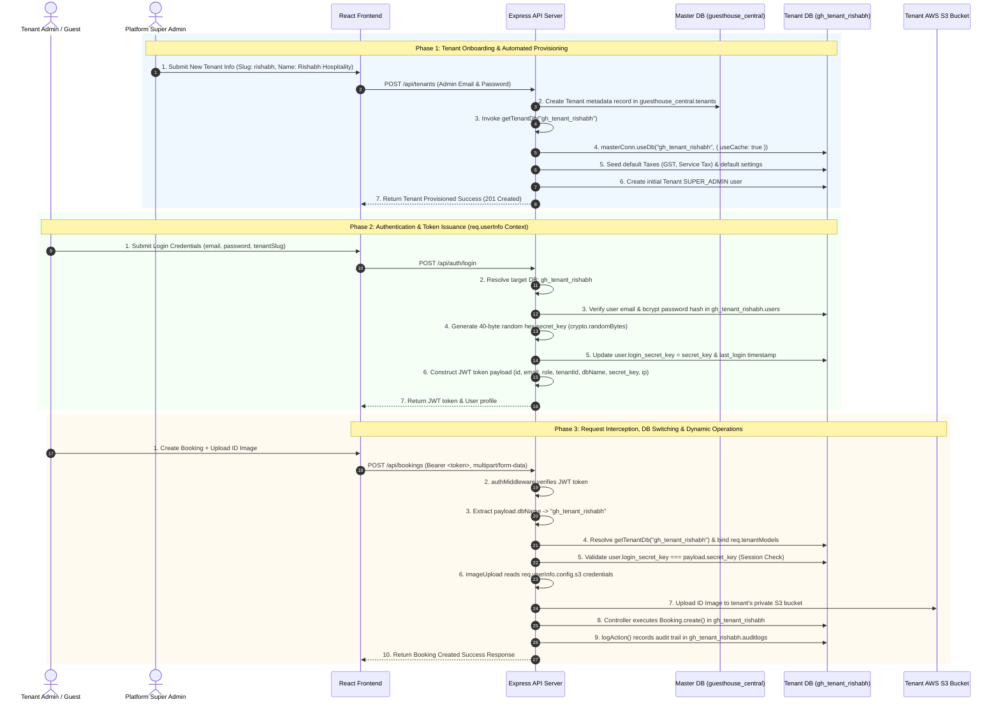

# Multi-Tenant System: Complete End-to-End Workflow & Architecture Guide

---

## 1. Ecosystem Overview

The **GuestHouseBookingSystem** implements **Physical Database Isolation per Tenant** running on a **Single MongoDB Cluster**. Database context switching happens dynamically per request using `connection.useDb()` with zero TCP overhead, while security and tenant context are enforced cryptographically via `req.userInfo`.

```
+----------------------------------------------------------------------------------------------------+
|                                GUEST HOUSE BOOKING SYSTEM WORKFLOW                                 |
+----------------------------------------------------------------------------------------------------+
|                                                                                                    |
|    +-----------------------------+                           +--------------------------------+    |
|    |    Central Control Plane    |                           |       Tenant Data Plane        |    |
|    |    (guesthouse_central)     |                           |    (gh_tenant_<tenant_slug>)   |    |
|    |  - Tenant Directory         |                           |  - GuestHouses, Rooms, Beds    |    |
|    |  - Tenant Metadata & Config |                           |  - Bookings, Payments, Taxes   |    |
|    |  - Platform Subscriptions   |                           |  - Tenant Admins, Staff, Guests|    |
|    +--------------+--------------+                           +---------------+----------------+    |
|                   |                                                          |                     |
|                   +---------------------------+------------------------------+                     |
|                                               |                                                    |
|                                               v                                                    |
|                               +-------------------------------+                                    |
|                               |   Dynamic Connection Manager  |                                    |
|                               | masterConn.useDb(tenantDbName)|                                    |
|                               +-------------------------------+                                    |
|                                                                                                    |
+----------------------------------------------------------------------------------------------------+
```

---

## 2. Sequence Diagram: End-to-End Multi-Tenant Lifecycle



---

## 3. Step-by-Step Technical Breakdown

### Step 1: Tenant Onboarding & Automated Provisioning
When a new organization joins the platform:
1. **API Endpoint**: `POST /api/tenants`
2. **Central Registration**: Creates a record in `guesthouse_central.tenants`:
   ```json
   {
     "name": "Rishabh Hospitality",
     "tenantId": "rishabh",
     "dbName": "gh_tenant_rishabh",
     "isActive": true,
     "config": {
       "siteName": "Rishabh Guest House",
       "s3": { "bucket_name": "rishabh-guest-house-images" }
     }
   }
   ```
3. **Database Seeding (`seedTenantDb`)**:
   - Dynamically initializes database `gh_tenant_rishabh` via `getTenantDb("gh_tenant_rishabh")`.
   - Seeds default tax rates (GST 12%, Service Tax 5%).
   - Creates the tenant's first `SUPER_ADMIN` user with hashed credentials.

---

### Step 2: Authentication & Token Issuance
1. **User Login**: User submits credentials to `POST /api/auth/login`.
2. **Tenant Resolution**:
   - Resolves target database name (e.g. `gh_tenant_rishabh`).
   - Reads `User` model on that database via `getTenantDb("gh_tenant_rishabh")`.
3. **Credentials & Session Key Generation**:
   - Verifies password using `bcrypt.compare`.
   - Generates a unique 40-byte random hex string:
     ```js
     const secretKey = crypto.randomBytes(40).toString("hex");
     ```
   - Saves `user.login_secret_key = secretKey` and `user.last_login = new Date()` into `gh_tenant_rishabh.users`.
4. **JWT Context Payload Generation**:
   - Generates JWT token containing complete `req.userInfo` context:
     ```json
     {
       "id": "60d5ec49f1a2c89b3f4e1234",
       "firstName": "John",
       "lastName": "Admin",
       "email": "admin@rishabh.com",
       "role": "SUPER_ADMIN",
       "tenantId": "rishabh",
       "dbName": "gh_tenant_rishabh",
       "secret_key": "a4f891b2c3d...",
       "ip_address": "192.168.1.15",
       "config": { "s3": { ... } }
     }
     ```

---

### Step 3: Request Interception & Dynamic Database Switching
For every API call (e.g., `GET /api/bookings`, `POST /api/rooms`, `GET /api/reports`):

1. **Header Extraction**: `authMiddleware` extracts token from `Authorization: Bearer <token>`.
2. **JWT Decoding**: Decodes payload and extracts `payload.dbName`.
3. **Dynamic Database Switching**:
   - Calls `getTenantDb(payload.dbName)`.
   - Mongoose switches database namespace instantly via `masterConn.useDb("gh_tenant_rishabh", { useCache: true })`.
   - All Mongoose schemas (`User`, `GuestHouse`, `Room`, `Bed`, `Booking`, `Tax`, `Payment`, `Invoice`, `AuditLog`, `Counter`) are compiled/reused on this connection.
4. **Session Security Check**:
   - Queries `gh_tenant_rishabh.users` for `user._id` and verifies `user.login_secret_key === payload.secret_key`.
   - If the key doesn't match (e.g., user logged in on another device or admin invalidated the session), request is rejected immediately (`401 Session Expired`).
5. **Context Attachment**:
   - Attaches `req.userInfo = payload`.
   - Attaches `req.tenantDb = tenantDb`.
   - Attaches `req.tenantModels = tenantDb.models`.

---

### Step 4: Controller Query Execution & Dynamic Asset Storage
1. **Controller Execution**:
   - Controller receives request with `req.tenantModels`.
   - Pulls required models directly:
     ```js
     const { Booking, GuestHouse, Room, Bed } = req.tenantModels;
     ```
   - Executes queries natively inside `gh_tenant_rishabh` without any `tenantId` query filters needed!
2. **Dynamic AWS S3 Uploads**:
   - Image upload middleware reads `req.userInfo.config.s3`.
   - Streams files to tenant's private S3 bucket using `uploadTenantImage()`.
3. **Tenant Audit Logging**:
   - `logAction(..., req.tenantDb)` logs system events into `gh_tenant_rishabh.auditlogs`.
4. **Response**: Sends clean, isolated JSON response back to the client.

---

## 4. Summary of Multi-Tenant Security & Isolation Safeguards

| Safeguard | Implementation Mechanism | Benefit |
|---|---|---|
| **Data Isolation** | Physical Database separation per tenant (`gh_tenant_<slug>`) | Zero risk of cross-tenant data leaks or accidental join contaminations. |
| **Connection Pooling** | `masterConn.useDb(dbName, { useCache: true })` | `~0ms` database switching with zero extra TCP socket overhead. |
| **Session Control** | 40-byte dynamic `login_secret_key` in Tenant DB | Allows remote session termination and single-device login enforcement. |
| **Token Theft Guard** | Client IP validation (`getClientIp(req)`) | Blocks stolen tokens from being reused from unauthorized IP locations. |
| **Asset Isolation** | Tenant-specific AWS S3 Bucket configuration in `req.userInfo.config.s3` | Private images, ID proofs, and signatures stored in isolated S3 buckets. |
