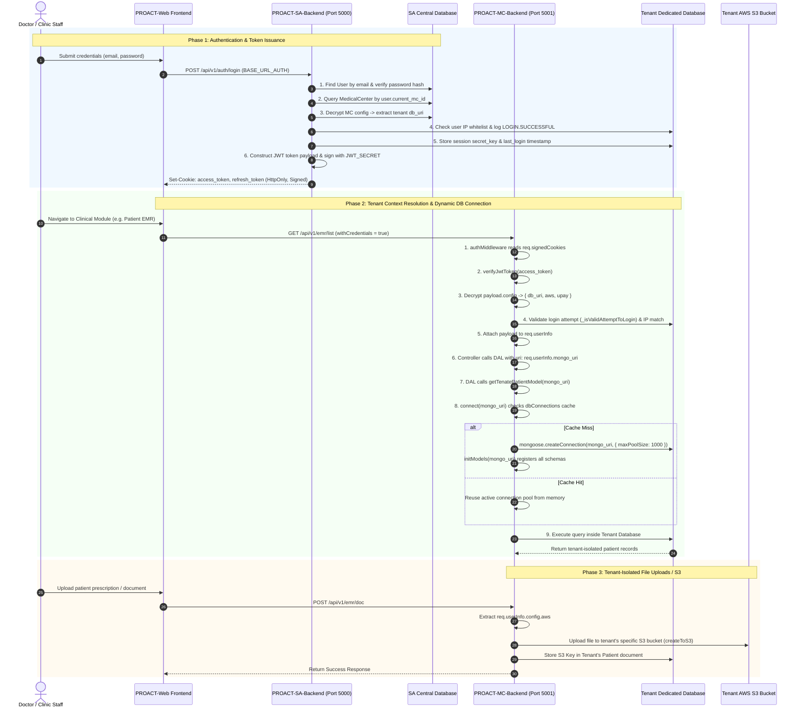

# Multi-Tenant Deep Dive: Tenant DB Dynamic Connection & `req.userInfo` Context Resolution

---

## 1. Executive Summary

In the **PROACT** ecosystem, multi-tenancy is implemented through **Physical Database Isolation (Database-per-Tenant)** paired with **Dynamic Connection Pooling** and **Cryptographic Session Context Resolution**.

This document explains:
1. **How each tenant database is connected dynamically** without restarting services.
2. **What `req.userInfo` contains**, what data is shared between backend services, and how it is encrypted and signed.
3. **The step-by-step lifecycle**: from login authentication in the Super Admin backend to dynamic query execution in the Medical Center backend and asset isolation in AWS S3.

---

## 2. Complete End-to-End Architectural Flow



---

## 3. How We Connect Each Tenant Database (`PROACT-MC-Backend`)

### 3.1 The Dynamic Connection Pool (`src/config/mongo.ts`)

Instead of establishing a static global database connection on server boot, `PROACT-MC-Backend` maintains an in-memory dictionary `dbConnections` that caches active Mongoose connection pools for every tenant.

```typescript
// PROACT-MC-Backend/src/config/mongo.ts

import mongoose, { ConnectOptions } from 'mongoose'
import { initModels } from '../models/index'

mongoose.set('strictQuery', false)

// In-memory Connection Pool Cache
const dbConnections: Record<string, mongoose.Connection> = {}

export const connect = async (url: string): Promise<mongoose.Connection> => {
    return new Promise(async (resolve, reject) => {
        try {
            if (!url) {
                const db: any = mongoose.connection
                if (db) resolve(db)
            } else {
                let connection: any
                // 1. Check if an active connection pool already exists for this tenant
                if (dbConnections[url]) {
                    connection = dbConnections[url]
                } else {
                    // 2. Create a dedicated connection pool for this tenant (up to 1000 concurrent sockets)
                    dbConnections[url] = await mongoose.createConnection(url, { 
                        maxPoolSize: 1000 
                    }).asPromise()

                    // 3. Register all system schemas and models against this new connection
                    await initModels(url)
                    connection = dbConnections[url]
                }
                resolve(connection)
            }
        } catch (error: any) {
            reject(error.message)
        }
    })
}
```

### 3.2 Schema Registration per Tenant (`src/models/index.ts`)

When a tenant connection is established for the first time, `initModels(uri)` compiles every Mongoose schema against that tenant's database connection:

```typescript
// PROACT-MC-Backend/src/models/index.ts

export const initModels = async (uri: string) => {
    const { Address } = await getTenateAddressModel(uri)
    const { Appointment } = await getTenateAppointmentModel(uri)
    const { Branch } = await getTenateBranchModel(uri)
    const { Department } = await getTenateDepartmentModel(uri)
    const { Doctor } = await getTenateDoctorModel(uri)
    const { Patient } = await getTenatePatientModel(uri)
    const { User } = await getTenateUserModel(uri)
    const { InvoiceValue } = await getTenateInvoiceModel(uri)
    const { Ipd } = await getTenantIpdModel(uri)
    const { Labtest } = await getTenateLabtestModel(uri)
    const { Radiologytest } = await getTenateRadiologytestModel(uri)
    // ... all 50+ system models registered on this tenant connection
}
```

### 3.3 Dynamic Model Getter Pattern

Every model exports a factory function that takes the tenant's `mongo_uri`, ensures the connection is resolved, and attaches the schema:

```typescript
// PROACT-MC-Backend/src/models/auth_module/User.ts

export const getTenateUserModel = async (mongo_uri: any) => {
    let db: any = await connect(mongo_uri)
    const User = db.model('User', UserSchema)
    return { db, User }
}
```

```typescript
// PROACT-MC-Backend/src/models/medical_center_module/patient.ts

export const getTenatePatientModel = async (mongo_uri: any) => {
    let db: any = await connect(mongo_uri)
    const Patient = db.model('Patient', PatientSchema)
    return { db, Patient }
}
```

---

## 4. What is `req.userInfo` & What Do We Share?

### 4.1 `req.userInfo` Data Structure

When a request reaches a protected route in `PROACT-MC-Backend`, `authMiddleware` populates `req.userInfo` with the decoded and decrypted tenant context:

```typescript
interface IUserInfo {
    id: string;               // User's Unique MongoDB ObjectId
    name: string;             // User's Full Name
    email: string;            // User's Email Address (lowercase)
    role: string;             // Role Name (e.g. 'MC_ADMIN', 'DOCTOR', 'RECEPTIONIST')
    mc_name: string;          // Name of the Medical Center / Tenant
    mongo_uri: string;        // Dedicated MongoDB connection string for this tenant
    secret_key: string;       // Dynamic 40-byte hex secret generated at login for session validation
    ip_address: string;       // Client IP captured at login (used to prevent session hijacking)
    config: {                 // Decrypted Infrastructure Credentials for this tenant
        db_uri: string;       // Duplicate of mongo_uri for internal DAL consistency
        aws: {                // Tenant-Specific Dedicated AWS S3 Storage Credentials
            key: string;          // AWS Access Key ID
            secretKey: string;    // AWS Secret Access Key
            bucket_name: string;  // Dedicated S3 Bucket Name
            region: string;       // AWS Region (e.g. 'us-east-1', 'me-south-1')
        };
        upay?: {              // Tenant-Specific Payment Gateway Credentials
            merchant_id: string;
            api_key: string;
            terminal_id: string;
        };
        whatsapp_exists?: boolean;
        upay_exists?: boolean;
    };
    moduleName?: string;      // (Optional) Module currently being validated by RBAC
}
```

### 4.2 Breakdown of What is Shared & Why

| Field | Origin | Sensitivity | Purpose in Multi-Tenancy |
| :--- | :--- | :--- | :--- |
| `id` & `email` | SA Central DB & MC DB | Public / PII | Identifies the requesting user within the tenant database. |
| `role` | MC DB / SA DB | Low | Used by `isAllowed` and `accessCheck` to enforce RBAC permissions. |
| `mc_name` | SA MedicalCenter record | Low | Displayed in UI headers, audit logs, and notification templates. |
| `mongo_uri` | SA MedicalCenter record | **High (Sensitive)** | **The Database Router**: Passed to all DAL functions to connect to the tenant's isolated DB. |
| `config` | Encrypted in SA DB (`AES-256`) | **Critical (Secret)** | Contains decrypted S3 keys and payment gateway credentials for that tenant. |
| `secret_key` | Generated at login (`crypto.randomBytes`) | **High (Security)** | Validated on every request against the tenant's `User.login_secret_key` to invalidate concurrent / terminated sessions. |
| `ip_address` | Captured at login (`getClientIp`) | Medium | Validated against the current request IP to prevent token theft / session hijacking. |

---

## 5. The Step-by-Step Implementation

### Step 1: Login & Token Generation (`PROACT-SA-Backend`)

When a user logs in via `PROACT-SA-Backend/src/controllers/authController.ts`:

1. **User Lookup**: Retrieves user from SA Central DB and verifies password.
2. **Tenant Retrieval**: Fetches tenant record via `DAMedicalCenter.getMedicalCenterDbUri(user.current_mc_id)`:
   ```typescript
   // PROACT-SA-Backend/src/data-access/super-admin/medicalcenter.ts
   let mcObj = await MedicalCenter.findOne({ _id: id })
   let decryptData = decrypt({ key: 'config', payload: mcObj.config });
   let encryptData = encrypt({ key: 'config', payload: decryptData });
   mc.encryptConfig = encryptData;
   mc.config = decryptData;
   ```
3. **Session Audit & Secret Key Generation**:
   ```typescript
   let secret_key = crypto.randomBytes(40).toString('hex')
   await addUserLastLoginToMc({
       email: user.email,
       uri: mcObj?.config?.db_uri,
       login_timestamp: new Date(),
       secret_key: secret_key,
       appChannelId
   })
   ```
4. **JWT Cookie Issuance (`setToken`)**:
   ```typescript
   // PROACT-SA-Backend/src/controllers/authController.ts
   createJwtToken(
       req,
       res,
       {
           id: user._id,
           name: user.name,
           email: user.email,
           role: userRoleName,
           mc_name: mcObj?.mc_name || null,
           config: mcObj?.encryptConfig || null,        // Encrypted AES payload
           mongo_uri: mcObj?.config?.db_uri || null,     // Tenant DB connection string
           secret_key: secret_key,
           ip_address: getClientIp(req),
       },
       token.refresh_token
   )
   ```
   - Sets signed HttpOnly cookies: `access_token` and `refresh_token`.

---

### Step 2: Frontend API Transmission (`PROACT-Web`)

The frontend configures Axios to communicate across both backends seamlessly:

1. **Dual Base URLs** (`src/config/config.ts`):
   - `BASE_URL_AUTH = 'http://localhost:5000/api/v1/'` (Super Admin Auth)
   - `BASE_URL = 'http://localhost:5001/api/v1/'` (Medical Center Operations)
2. **Credential Propagation** (`src/axios.ts`):
   ```typescript
   axios.defaults.withCredentials = true
   ```
   Because cookies are set with `HttpOnly` and domain credentials, the browser automatically sends the signed `access_token` and `refresh_token` cookies with every request to `PROACT-MC-Backend`.

---

### Step 3: Request Interception & Tenant Context Resolution (`PROACT-MC-Backend`)

When a request arrives at `PROACT-MC-Backend`, [`authMiddleware.ts`](file:///c:/Users/Reyna/Desktop/PROACT-MAIN/PROACT-MC-Backend/src/middlewares/authMiddleware.ts) executes:

```typescript
// PROACT-MC-Backend/src/middlewares/authMiddleware.ts

export const authMiddleware = async (req: Request, res: Response, next: NextFunction) => {
    const { access_token, refresh_token } = req.signedCookies
    const appChannelId = req.body.appChannelId;

    if (!refresh_token) {
        throw new NotAuthorize('Not Authorize to access page!')
    }

    try {
        if (access_token) {
            const payload = verifyJwtToken(access_token)
            if (payload) {
                // 1. Ensure user is associated with a tenant DB
                if (!payload?.mongo_uri) {
                    throw new BadRequest('Please associate with atleast one medical center, to avail services')
                }

                // 2. Decrypt tenant config (AWS S3 & Upay credentials)
                if (payload?.config) {
                    payload.config = decrypt({ key: 'config', payload: payload?.config })
                }

                // 3. Verify session validity in the Tenant's Database
                await _isValidAttemptToLogin({ 
                    query: { secret_key: payload.secret_key, email: payload.email, appChannelId }, 
                    uri: payload.config.db_uri 
                })

                // 4. Verify request IP matches login IP
                if (payload?.ip_address && getClientIp(req) !== payload.ip_address) {
                    throw new NotAuthorize('Access denied: request from an unrecognized IP address')
                }

                // 5. Attach decoded & validated context to req.userInfo
                req.userInfo = payload
                next()
                return
            }
        }
        // ... (Refresh token fallback if access_token expired)
    } catch (error: any) {
        throw new NotAuthorize('Not authorize')
    }
}
```

---

### Step 4: Data Access Layer (DAL) Query Execution in Tenant DB

Controllers extract `req.userInfo.mongo_uri` and delegate to DAL functions. The DAL function passes `uri` to model getters, ensuring **strict physical database isolation**:

```typescript
// Example: Controller layer (PROACT-MC-Backend/src/controllers/medical_center_module/branchController.ts)
export const createBranch = async (req: Request, res: Response) => {
    const data = req.body.payloadData.requestData
    
    // Pass tenant mongo_uri from req.userInfo to DAL
    const branchObj = await DABranch.addBranch({ 
        payload: data, 
        uri: req.userInfo.mongo_uri 
    })

    res.status(200).json(plainRes({ payload: { data: branchObj[0], message: 'Branch created' }, rc: 0 }))
}
```

```typescript
// Example: DAL layer (PROACT-MC-Backend/src/data-access/medical_center_module/branch.ts)
export const addBranch = async ({ payload, uri }: IDal) => {
    // 1. Get model connected dynamically to this tenant's DB
    const { db, Branch } = await getTenateBranchModel(uri)

    // 2. Start a transaction on this specific tenant's database connection
    const session = await db.startSession()
    let branchObj: any

    try {
        await session.withTransaction(async () => {
            // All operations run strictly inside this tenant's DB
            branchObj = await Branch.create([payload], { session })
            await session.commitTransaction()
        })
    } finally {
        session.endSession()
    }

    return branchObj
}
```

---

### Step 5: Dynamic Tenant-Specific Cloud File Storage (AWS S3)

When uploading files (e.g., patient prescriptions, lab reports, EMR attachments), PROACT dynamically selects the tenant's own S3 bucket using `req.userInfo.config.aws`:

```typescript
// PROACT-MC-Backend/src/utils/uploadToS3Dynemic.ts

export const createToS3 = async (aws: any, payload: any | any[]) => {
    // Connects to AWS S3 using the tenant's specific credentials
    const S3Object = await S3Dynemic.connectAws(aws)
    
    const uploadParams = {
        Bucket: aws.bucket_name,                     // Tenant's private S3 bucket
        Key: `${payload.newPath}/${payload.newName}`,
        Body: payload.buffer,
        ContentType: payload.fileType,
    }

    const upload = await S3Object.upload(uploadParams).promise()
    return upload.Key
}
```

Usage in controllers:
```typescript
const s3Keys = await createToS3(req.userInfo.config.aws, formattedPayload)
```

---

## 6. Security Summary & Isolation Safeguards

```
+-----------------------------------------------------------------------------------------------+
|                                MULTI-TENANT SECURITY CONTROLS                                 |
+-----------------------------------------------------------------------------------------------+
|                                                                                               |
|  1. Physical Database Separation:                                                             |
|     - Queries execute on isolated connection pools (mongoose.createConnection).               |
|     - No shared collections or accidental cross-tenant data leaks.                            |
|                                                                                               |
|  2. Cryptographic Protection:                                                                 |
|     - Infrastructure secrets (DB URIs, AWS keys, Upay keys) encrypted with AES-256 (CryptoJS)|
|     - Tokens signed with JWT_SECRET in HttpOnly secure cookies.                              |
|                                                                                               |
|  3. Session Hijacking Protection:                                                             |
|     - IP Whitelist Verification (Client IP compared against login IP).                        |
|     - Secret Key Invalidation (User.login_secret_key verified in tenant DB on every request).|
|                                                                                               |
|  4. Dynamic Asset Isolation:                                                                  |
|     - Medical center attachments stored in separate tenant-owned AWS S3 buckets.              |
|                                                                                               |
|  5. Multi-Layer RBAC & Quotas:                                                                |
|     - Access rights checked against tenant DB's Accesses collection (accessCheck).           |
|     - Resource creation throttled by tenant package limits (max_users, max_branches, etc.).   |
|                                                                                               |
+-----------------------------------------------------------------------------------------------+
```

---

## 7. Key Files Reference Index

- **Connection Pooling**: [`PROACT-MC-Backend/src/config/mongo.ts`](file:///c:/Users/Reyna/Desktop/PROACT-MAIN/PROACT-MC-Backend/src/config/mongo.ts)
- **Model Compilation**: [`PROACT-MC-Backend/src/models/index.ts`](file:///c:/Users/Reyna/Desktop/PROACT-MAIN/PROACT-MC-Backend/src/models/index.ts)
- **Auth & Tenant Middleware**: [`PROACT-MC-Backend/src/middlewares/authMiddleware.ts`](file:///c:/Users/Reyna/Desktop/PROACT-MAIN/PROACT-MC-Backend/src/middlewares/authMiddleware.ts)
- **Central Auth Controller**: [`PROACT-SA-Backend/src/controllers/authController.ts`](file:///c:/Users/Reyna/Desktop/PROACT-MAIN/PROACT-SA-Backend/src/controllers/authController.ts)
- **Tenant Management Controller**: [`PROACT-SA-Backend/src/controllers/super-admin/medicalCenter.ts`](file:///c:/Users/Reyna/Desktop/PROACT-MAIN/PROACT-SA-Backend/src/controllers/super-admin/medicalCenter.ts)
- **Dynamic S3 Storage**: [`PROACT-MC-Backend/src/utils/uploadToS3Dynemic.ts`](file:///c:/Users/Reyna/Desktop/PROACT-MAIN/PROACT-MC-Backend/src/utils/uploadToS3Dynemic.ts)
- **Encryption Helpers**: [`PROACT-SA-Backend/src/utils/encrypt.ts`](file:///c:/Users/Reyna/Desktop/PROACT-MAIN/PROACT-SA-Backend/src/utils/encrypt.ts) & [`PROACT-MC-Backend/src/utils/encrypt.ts`](file:///c:/Users/Reyna/Desktop/PROACT-MAIN/PROACT-MC-Backend/src/utils/encrypt.ts)
